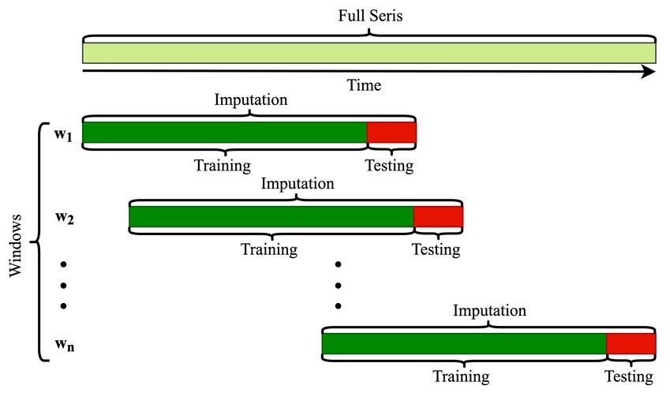
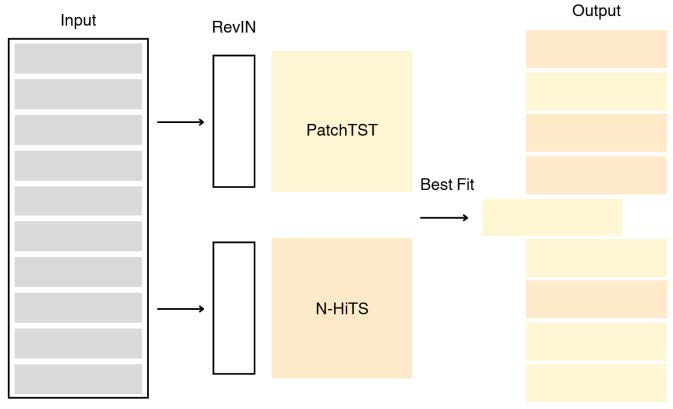

# 📊 Forecasting Commodity Prices Across Indonesia using PatchTST & N-HiTS

## 🏆 Competition Context
This project was developed for the **Datavidia 9** preliminary round, part of **Arkavidia 9.0**. The challenge involved forecasting daily prices of **13 food commodities** across **34 provinces in Indonesia**, using historical multivariate time series data. The goal was to predict commodity prices for the period of **October to December 2024**.

## 🔍 Why Deep Learning?
Traditional forecasting methods like **XGBoost** and **ARIMA** are strong baselines, but they come with challenges — such as requiring stationary data or extensive feature engineering. Instead, we explored **deep learning-based models** for their flexibility, scalability, and ability to capture nonlinear temporal patterns across many time series.

## 🧠 Our Approach
We implemented two state-of-the-art models using the [NeuralForecast](https://github.com/Nixtla/neuralforecast) library:

- **PatchTST**: A Transformer-based model that splits time series into patches to learn both local and long-range dependencies efficiently.
- **N-HiTS**: An MLP-based model that extends the N-BEATS architecture by using hierarchical interpolation and multi-scale sampling to capture seasonal structures.

## 🧹 Data Enhancement & Preprocessing
To improve forecasting accuracy, we:
- Enriched the dataset by scraping **Indonesian national holidays**, adding features like `is_holiday`, `prev_day_holiday`, and `next_day_holiday`.
- Removed corrupted data from **July 2022**.
- Applied simple imputation techniques based on province/commodity to handle remaining missing values.

## ⚙️ Training & Evaluation
- **Training time**: 
  - PatchTST: < 3 minutes  
  - N-HiTS: < 1 minute  
  (for the entire dataset)
- **Evaluation strategy**: Rolling forecasting using **MAPE** as the evaluation metric.

- We applied a **best-fit strategy**: For each commodity-province pair, the model with the lowest validation MAPE was used for the final prediction.

## 📈 Results
| Model        | Validation MAPE |
| ------------ | --------------- |
| TimesNet     | 0.0964          |
| iTransformer | 0.0995          |
| RMoK         | 0.0959          |
| **N-HiTS**   | **0.0807**      |
| **PatchTST** | **0.0755**      |
| **PatchTST+N=HiTS** | **0.0694**      |
- **Final Validation MAPE**: `0.0694`
- **Private Leaderboard Score**: `0.04546`

These results demonstrate that deep learning models can be applied efficiently and effectively to complex, real-world forecasting problems involving economic and policy-relevant data.

## 📎 Links
- 📄 [Kaggle](https://www.kaggle.com/competitions/comodity-price-prediction-penyisihan-arkavidia-9)
- 📊 [NeuralForecast Library](https://github.com/Nixtla/neuralforecast)
- 📑 [Project Report (PDF)](./Arkavidia9_Datavidia_bukan%20amigos.pdf)

---

Feel free to fork, star, or open an issue if you have questions!

## 👥 Team Members
| Name                   | GitHub                                                         |
| ---------------------- | -------------------------------------------------------------- |
| Rifqi Hafizuddin       | [@RifqiHafizuddin](https://github.com/RifqiHafizuddin)         | 
| Favian Sulthan Wafi    | [@Favian Sulthan Wafi](https://github.com/FavianSulthanW)          | 
| Aurelio Naufal Effendy | [@Aurelio-Naufal](https://github.com/Aurelio-Naufal)     |

